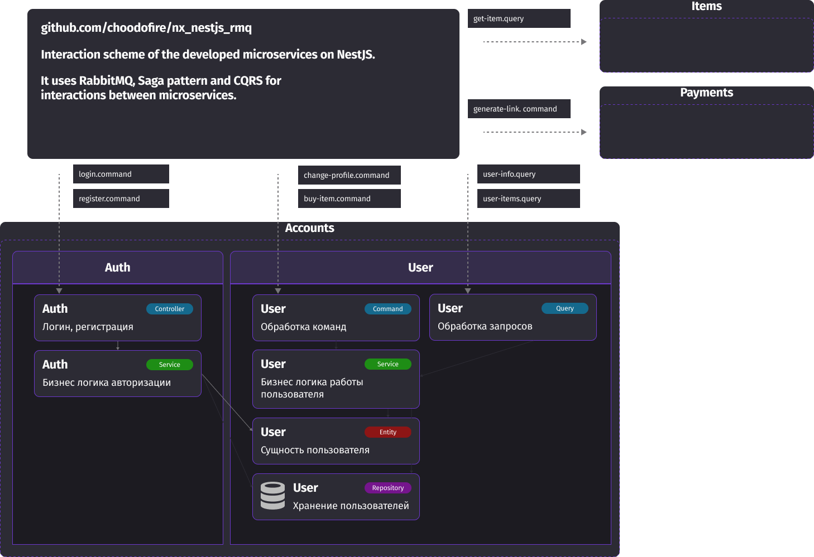

## Example of microservices implementation in NestJS + RabbitMQ using NX monorepository using Saga pattern and CQRS.

To start use this command:

``` nx run-many --target=serve --all --parallel=10```

Tests: 

```nx run-many --target=test --all --parallel=10```

Scheme of interactions:



## Development server

Run `nx serve account` for a dev server. Navigate to http://localhost:4200/. The app will automatically reload if you change any of the source files.

## Understand this workspace

Run `nx graph` to see a diagram of the dependencies of the projects.

## Remote caching

Run `npx nx connect-to-nx-cloud` to enable [remote caching](https://nx.app) and make CI faster.

## Further help

Visit the [Nx Documentation](https://nx.dev) to learn more.
